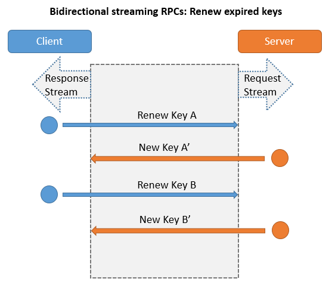

# KMS.gRPC

Key management System in ASP.NET Core 3 gRPC.


## Features

- Supports TripleDES, Secret(MD5), RSA keypair distribution.
- Custom cycle time to audit keys in client side. The audit report can be seen in [https://kms:5001/report/index](https://localhost:5001/report/index).
- Custom cycle time to renew expired keys.
- Crypto library that supports
  * TripleDES encryption/decryption.
  * RSA encryption/decryption, sign/verify signaure.
  * Use MD5 to create hash value as Shared Secret
- Use Redis to store the working or deprecated keys.


## Tutorials

- [[ASP.NET Core] gRPC - Get started](https://karatejb.blogspot.com/2020/06/aspnet-core-grpc-get-started.html)


## Key exchange process

1. First get a session key (TripleDES key) from KMS.
2. Use the session key to encrypt the new keys (Secrets, RSA ...) from server to client, or auditing keys from client to server.


## Key renew process

Client use a timer to checks its keys' expiration date. If a key is expired, client will ask for a new one from KMS and KMS will put the expired key from Key Vault to Deprecated Key Vault.


## About codes

| Project name | Project type | Description | Note |
|:-------------|:------------:|:------------|:-----|
| Kms.gRPC | ASP.NET Core gRPC Service | KMS (server side) | gRPC services |
| Kms.gRPC.Client | ASP.NET Core Web App | KMS client side | gRPC client |
| Kms.KeyMngr | Class library |  Key manangement library | |
| Kms.Client.Dispatcher | Class library | KMS client key exchange/renew/audit library | |
| Kms.Crypto | Class library | Crypto library | For key generation, encryption and decryption |
| Kms.Core | Class library | Protocol buffers for entire projects, and reusable utilities | |


## gRPC Service methods

```csharp
service KeyVaulter {
  // Unary RPC: Create symmetric key
  rpc CreateSymmentricKey (CreateKeyRequest) returns (CipherKey);

  // Unary RPC: Create single asymmetric key
  rpc CreateAsymmetricKey (CreateKeyRequest) returns (EncryptedData);

  // Server streaming RPC: Create shared secrets
  rpc CreateSharedSecrets (CreateKeyRequest) returns (stream EncryptedData);

  // Unary RPC: Get shared secrets
  rpc GetSharedSectets (GetKeyRequest) returns (EncryptedData);

  // Server streaming RPC: Get others' public keys 
  rpc GetPublicKeys (GetKeyRequest) returns (stream EncryptedData);

  // Client streaming RPC: Audit working keys
  rpc AuditWorkingKeys (stream EncryptedData) returns (KeyAuditReports);

  // Bidirectional streaming RPC: Audit working keys
  rpc AuditWorkingKeysBid (stream EncryptedData) returns (stream KeyAuditReport);

  // Bidirectional streaming RPC: Renew keys
  rpc RenewKeysBid (stream EncryptedData) returns (stream EncryptedData);
}
```


## How Server(KMS)/Client works with gRPC


### Unary RPCs

#### Create symmetric key

A client requests for a symmeytric key (session key), and server responds one for it.

> The session key is used for encrypt/decrypt the sensitive information between the communication of KMS and client.


#### Create single asymmetric key, Get shared secrets

A client can

1. Ask KMS for creating its own asymmetric key pair (private key + public key)
2. Get its exist Shared Secret(s)


### Server streaming RPCs

#### Create Shared Secrets, Get Public Keys

A client requests for multiple keys, and server writes the keys to the Response Stream while the client can get each of the keys asynchronously by reading the Response stream.

A client can

1. Ask KMS for creating its own shared secrets
2. Get other clients' exist public keys


### Client streaming RPCs


#### Audit working keys

The client send its own keys to server by writing each of them to the Request Stream, and the server audit each of the keys to see if it is legal. After the server receives(reads) all the keys from the Request Stream, it returns the audit result.


### Bidirectional streaming RPCs


#### Audit working keys

The Bidirectional streaming version of auditing working keys.


#### Renew expired keys

The client sends(writes) each of the expired keys to the Request Stream, and server returns(writes) each of the new keys to the Response Stream.




