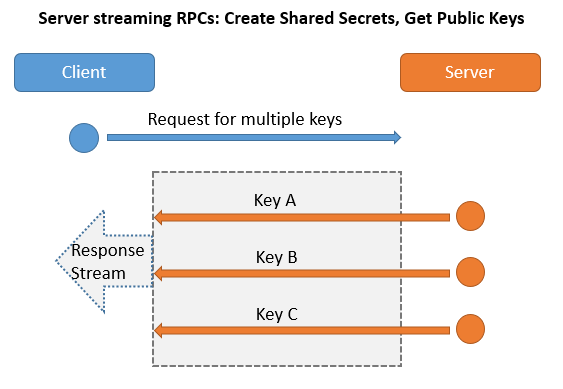

# KMS.gRPC

Key management System in ASP.NET Core 3 gRPC.

## Features

- Supports TripleDES, Secret(MD5), RSA keypair distribution.
- Custom cycle time to audit keys in client side. The audit report can be seen in [https://kms:5001/report/index](https://localhost:5001/report/index).
- Custom cycle time to renew expired keys.
- Crypto library that supports
  * TripleDES encryption/decryption.
  * RSA encryption/decryption, sign/verify signaure.
- Use Redis to store the working or deprecated keys.

## Key exchange process

1. First get a session key (TripleDES key) from KMS.
2. Use the session key to encrypt the new keys (Secrets, RSA ...) from server to client, or auditing keys from client to server.

## Key renew process

Client use a timer to checks its keys' expiration date. If a key is expired, client will ask for a new one from KMS and KMS will put the expired key from Key Vault to Deprecated Key Vault. 

## How Server(KMS)/Client works with gRPC

### Unary RPCs

> The client requests for a session key, and server responds one for it

### Server streaming RPCs

> The client requests for multiple keys, and server writes the keys to the Response Stream while the client can get each of the keys asynchronously by reading the Response stream.

### Client streaming RPCs

> The client send its own keys to server by writing each of them to the Request Stream, and the server audit each of the keys to see if it is legal. After the server receives(reads) all the keys from the Request Stream, it returns the audit result.

### Bidirectional streaming RPCs

> The client sends(writes) each of the expired keys to the Request Stream, and server returns(writes) each of the new keys to the Response Stream.

## About codes

| Project name | Project type | Description | Note |
|:-------------|:------------:|:------------|:-----|
| Kms.gRPC | ASP.NET Core gRPC Service | KMS (server side) | gRPC services |
| Kms.gRPC.Client | ASP.NET Core Web App | KMS client side | gRPC client |
| Kms.KeyMngr | Class library |  Key manangement library | |
| Kms.Client.Dispatcher | Class library | KMS client key exchange/renew/audit library | |
| Kms.Crypto | Class library | Crypto library | For key generation, encryption and decryption |
| Kms.Core | Class library | Protocol buffers for entire projects, and reusable utilities | |

## Reference

- [[ASP.NET Core] gRPC - Get started](https://karatejb.blogspot.com/2020/06/aspnet-core-grpc-get-started.html)

